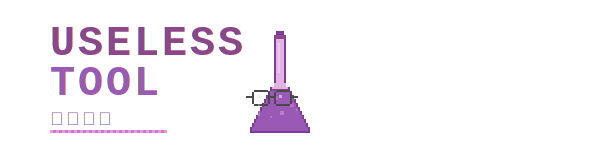

# 极简图片处理工具 (Minimalist Image Processing Tool)

一款运行在浏览器端的轻量级、无依赖、注重隐私的图片处理工具，专注于提供最纯粹的**裁剪**与**拼接**核心功能。

####[点击这里访问在线工具](https://Ye-HHH.github.io/image-tool/)

## ✨ 功能特性

### 1. 🖼️ 图片裁剪 (Image Cropping)

* **精准控制**: 自由拖拽裁剪框，通过鼠标滚轮缩放图片，拖动图片本身进行摇摄，实现像素级精确定位。
* **多种模式**:
    * **预设比例**: 提供 `1:1`, `4:3`, `16:9` 等常用比例，一键切换。
    * **自由比例**: 不受任何限制，随心裁剪。
    * **精确像素**: 可直接输入目标的长度和高度像素值来设定裁剪框比例。

### 2. 🧩 图片拼接 (Image Stitching)

* **灵活管理**:
    * **拖拽排序**: 上传后，直接在预览区拖动图片调整顺序。
    * **单张删除与一键清除**: 提供精细化的图片列表管理功能。
* **两种拼接方向**:
    * **横向拼接**: 将多张图片从左到右拼接成一张宽图。
    * **竖向拼接**: 将多张图片从上到下拼接成一张长图。
* **标准化拼接**:
    * 在拼接前，可以**任选一张图片作为标准**。
    * 其他图片将根据所选方向，自动等比缩放至与标准图**同高**（横向拼接时）或**同宽**（竖向拼接时），确保拼接结果整齐划一。

## 🚀 技术栈

* **HTML5**
* **Tailwind CSS**: 用于快速构建现代化、响应式的用户界面。
* **JavaScript (ES6+)**: 实现所有核心逻辑。
* **Cropper.js**: 一个功能强大且成熟的图片裁剪库。
* **SortableJS**: 一个轻量、零依赖的拖拽排序库。

  
  
  

